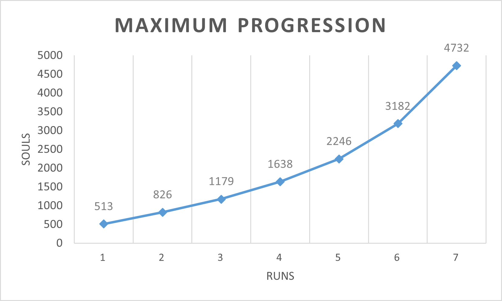

# Problema de Dark Souls

## Lea la version en ingles en: [English](README.md)

## Narrativa
En la Edad de los Antiguos el mundo estaba sin formar, envuelto por la niebla. Una tierra de peñascos grises, Archi-arboles y Dragones Eternos. Pero entonces llegó el Fuego y con el fuego llegó la disparidad. El calor y el frío, la vida y la muerte, y por supuesto, la luz y la oscuridad. Entonces, desde la oscuridad, vinieron, y encontraron las Almas de los Señores dentro de la llama.

Así comenzó la Era del Fuego. Pero pronto las llamas se desvanecerán y sólo quedará la oscuridad. Incluso ahora sólo hay brasas, y el hombre no ve la luz, sino sólo noches interminables. Y entre los vivos se ven, portadores del maldito Signo de la Oscuridad.

Tú eres el no-muerto elegido, destinado a reavivar el fuego, pero para ello necesitas consumir las almas oscuras y asi ganar poder.

Actualmente hay 3 lugares en los que el cultivo de almas es más rentable, cada lugar ofrece mejores recompensas en función de una de las tres habilidades principales: `fuerza`, `destreza` y `descubrimiento de objetos`.

## Ubicaciones

### Alto Muro de Lothric


Hogar de los caballeros, el Alto Muro de Lothric presenta el lugar perfecto para ganar almas para las builds orientadas a la `fuerza` mientras que también castiga a las builds orientadas a la `Destreza`, después de innumerables corridas, se determinó que el número de almas rendidas por corrida sigue la siguiente fórmula:

```haskell
almas_lotric :: (Int,Int,Int) -> Float
almas_lotric (str,dex,item_discovery) = str_earned + dex_earned + total_items
    where
        str_earned = 3*str
        dex_earned = (-11)*dex/7
        ítems_altos = (ítem_discovery/4)
        mid_items = 5*(item_discovery/4)
        elementos_bajos = 3*(item_discovery/2)
        total_items= high_items + mid_items + low_items
```


### Ruinas de Nuevo Londo


Nueva Londo, una vez una gran ciudad, ahora reside olvidada en el fondo de un pozo inundado, por lo que se requiere una combinación de `fuerza` y `destreza` para vencer los desafíos que plantea, a través de ensayo y error, se determinó que el número de almas rendidas por carrera es:

```haskell
almas_londo :: (Int,Int,Int) -> Float
souls_londo (str,dex,item_discovery) = combined_earned + total_items
    where
        combinado_ganado = (str*dex) - 2*(str+dex)
        artículos_altos = 3*(item_discovery/5)
        artículos_medios = 2*(item_discovery/4)
        elementos_bajos = (11*item_discovery/20)
        total_items= high_items + mid_items + low_items
```

### Los Archivos del Duque


Los Archivos del Duque es un gigantesco complejo de bibliotecas desoladas cuyos tesoros son gratuitos para los valientes, por lo que favorece enormemente la habilidad ``descubrimiento de ítems``, el número de almas que rinde cada recorrido viene dado por:

```haskell
almas_archivos :: (Int,Int,Int) -> Float
almas_archivas (str,dex,item_discovery) = str_earned + dex_earned + total_items + 300
    where
        str_earned = -str
        dex_earnet = 5*dex/2
        artículos_altos = 3*(ítem_discovery/2) 
        mid_items = (item_discovery/2)
        total_items= high_items + mid_items
```

## Mecánica: Subir de nivel

Hasta ahora, hemos hablado de cómo cada lugar está influenciado por el nivel de habilidad del personaje, pero no hemos hablado de cómo crece el personaje.

Para subir de nivel y ganar un punto de habilidad (que aumenta en 1 una determinada habilidad), el no muerto elegido debe pagar un precio en almas igual a la siguiente relación:

```haskell
subir_nivel :: (Int,Int) -> Int
subir_nivel(nuevos_niveles,total_niveles) = nuevos_niveles*total_niveles/300 + 5*nuevos_niveles
```

## Objetivo y especificaciones iniciales:

El objetivo es maximizar el número de almas en la `n-th` carrera, siempre que el no-muerto elegido comience con las siguientes estadísticas:

```haskell
Base_Stats = {
    Str: 3,
    Dex: 2,
    Item: 3,
    Almas iniciales: 200
}
```
## Resultados

Después de resolver el problema para $n = 1 \dots 7$, recogemos los resultados en la siguiente tabla:


| Run # | obj_max | total str | total dex | total item | Fav Place              |
|-------|---------|-----------|-----------|------------|------------------------|
| 1     | 513     | 0         | 0         | 0          | archives (1)           |
| 2     | 826     | 0         | 0         | 0          | archives (2)           |
| 3     | 1179    | 0         | 0         | 40         | archives (3)           |
| 4     | 1638    | 0         | 0         | 116        | archives (4)           |
| 5     | 2246    | 0         | 0         | 177        | archives(5)            |
| 6     | 3182    | 0         | 0         | 347        | archives(3), lotrhic(3) |
| 7     | 4732    | 78        | 0         | 400        | archives(3), lotrhic(4) |

La cual presenta una idea interesante, verás, la mayoría de los juegos sigue una tendencia lógica: la build óptima es una build _pura_ (enfocada en una sola habilidad), o una build _híbrida_ (enfocada en 2 habilidades), pero en este caso, el programa determinó que el mejor curso de acción era comenzar como una build _pura de descubrimiento de ítems_, y luego de cosechar las recompensas de los archivos, bifurcarse a un _híbrido ítem/str_.

Esto nos da una idea interesante sobre el problema: siempre que tengamos un problema que se alimente a sí mismo (cada mes determina los recursos del proximo mex), tratará de minimizar la rentabilidad por sí mismo, por lo que el análisis de sensibilidad no es estrictamente necesario, podemos simplemente ejecutar otra iteración y observar los resultados.

## Proceso de modelado (opcional)

### El ~~Axioma~~ de la Elección:

Estudiemos el caso para un solo día, ingenuamente podríamos sugerir que el número total de almas ganadas para el día 1 sería (abusando un poco de la notación)

```C
almas_base +
almas_lodicas(base_stats+nivel_stats) + 
almas_londo(base_stats+estados_nivelados) + 
almas_archivo(base_stats+estados_nivelados) -
level_up(#estados_base,#estados_nivelados)
```

Sin embargo, si lo analizamos más detenidamente, esto es claramente erróneo por una razón muy precisa: no podemos visitar varios lugares en la misma corrida, debemos **elegir exactamente una** ubicación.

Por suerte, la forma de modelar la "elección" es sencilla: digamos que tenemos dos acciones: `a_1` y `a_2`, entonces:

```C
max/min z = e_1 * a_1 + e_2*a_2
```

Sujeto a:

```C
e_1*e_2 = 0
e_1+e_2 = 1
```

Modela perfectamente el predicado: se puede hacer `a_1` o `a_2` pero no ambos, esto es debido a las restricciones, ya que si `e_1*e_2 = 0` entonces

* `e_1 = 0`, y por tanto `max/min z = 0 * a_1 + e_2 *a_2 = e_2*a_2`
* `e_2 = 0`, y por tanto `max/min z = e_1 * a_1 + 0 *a_2 = e_1*a_1`

Además, dado que `e_1+e_2 > 0` se cumple, entonces sigue que al menos uno de los pares es `1` (es decir, debemos hacer cualquiera de las dos acciones exactamente una vez).

Ahora que tenemos una forma de modelar la elección, podemos decir que nuestra función objetivo para el día 1 será

```C
base_almas +
lothric_1 * souls_lothric(total_str_1, total_dex_1, total_item_1) +
londo_1 * souls_londo(total_str_1, total_dex_1, total_item_1) +
archivos_1 * almas_archivos(total_str_1, total_dex_1, total_item_1) -
level_up(total_levels_1,0)
```

Sujeto a:

```C
lothric_1 * londo_1 = 0 {
lothric_1 * archives_1 = 0 { A lo sumo se puede elegir 1 de las 3 ubicaciones
londo_1 * archivos_1 = 0 {
lothric_1 + londo_1 + archives_1 = 1 <- Se debe elegir al menos 1 ubicación
base_souls - level_up(total_levels_1,0) >= 0 <- no se puede endeudar
```

(En la práctica, ya que los solucionadores utilizan métodos de relajación, y la aritmética de punto flotante no es precisa alrededor de 0, nosotros *debemos* relajar las restricciones: `lothric_1 * londo_1 = 0 => lothric_1 * londo_1 <= 1`, más sobre esto en la sección Cómo dejé de preocuparme)

## Declaración de datos (Lectura opcional):

Introduzcamos alguna notación por conveniencia

* `str_i : Int` -> Número de puntos de `fuerza` ganados en la corrida `i`
* `dex_i : Int` -> Número de puntos de `destreza` ganados en la corrida `i`
* `item_i : Int` -> Número de puntos de `descubrimiento de objetos` ganados en la corrida `i`
* `lotrhic_i : Int` -> Valor discreto (0 | 1) que indica si visitamos o no `lothric` en la corrida `i` 
* `londo_i : Int` -> Valor discreto (0 | 1) que indica si visitamos o no `londo` la corrida `i`
* `archivos_i : Int` -> Valor discreto (0 | 1) que indica si visitamos o no los "archivos" la corrida "i


## Función objetivo y restricciones por ejecución

### Ejecución 1

Para la primera ejecución, la función objetivo sería

```haskell
f_1 =
    base_almas_0 +
    lothric_1 * souls_lothric(total_str_1, total_dex_1, total_item_1) +
    londo_1 * souls_londo(total_str_1, total_dex_1, total_item_1) +
    archivos_1 * almas_archivos(total_str_1, total_dex_1, total_item_1) -
    level_up(total_levels_1,0)
```
Sujeto a:

* `lotrhic_1*londo_1 = 0` - No se puede visitar lothric y londo al mismo tiempo
* `lotrhic_1*archivos_1 = 0` - No se puede visitar lothric y los archivos al mismo tiempo
* `londo_1*archivos_1 = 0` - No se puede visitar londo y los archivos al mismo tiempo
* `total_levels_1 = str_1 + dex_1 + item_1` - Sólo por verbosidad
* `almas_básicas_0 - nivel_superior(niveles_totales_0) >= 0` - No se puede endeudar
* `total_str_1 = base_str + str_1` - Útil para la ejecución 2
* `total_dex_1 = base_dex + dex_1` - Útil para la ejecución 2
* `total_item_1 = base_item + item_1` - Útil para la ejecución 2


### Run 2


Para la segunda ejecución, la función objetivo sería

```haskell
f_2 =
    f_1 +
    lothric_2 * souls_lothric(total_str_2, total_dex_2, total_item_2) +
    londo_2 * souls_londo(total_str_2, total_dex_2, total_item_2) +
    archivos_2 * almas_archivos(total_str_2, total_dex_2, total_elemento_2) -
    level_up(total_levels_2)
```

Sujeto a:

* `Restricciones 1` - Restricciones para la carrera 1
* `lotrhic_2*londo_2 = 0` - No se puede visitar lothric y londo al mismo tiempo
* `lotrhic_2*archives_2 = 0` - No se puede visitar lothric y los archivos al mismo tiempo
* `londo_2*archivos_2 = 0` - No se puede visitar londo y los archivos al mismo tiempo
* `nuevos_niveles = str_2 + dex_2 + item_2`
* `total_levels_2 = total_levels_1 + new_levels` - Sólo por verborrea
* `f_1 - level_up(new_levels,total_levels_2) >= 0` - No se permite endeudarse para subir de nivel.
* `total_str_2 = total_str_1 + str_2` - Útil para la ejecución 3
* `total_dex_2 = total_str_1 + dex_2` - Útil para la ejecución 3
* `total_item_2 = total_str_1+ item_2` - Útil para la ejecución 3


### Run n

Para la ejecución `n-th`, la función objetivo sería


```haskell
f_n =
    f_(n-1) +
    lothric_n * souls_lothric(total_str_n, total_dex_n, total_item_n) +
    londo_n * souls_londo(total_str_n, total_dex_n, total_item_n) +
    archivos_n * almas_archivas(total_str_n, total_dex_n, total_item_n) -
    level_up(new_levels,total_levels_(n-1))
```

Sujeto a:

* `Restricciones (n-1)` - Restricciones para la carrera `(n-1)`
* `lotrhic_n*londo_n = 0` - No se puede visitar lothric y londo al mismo tiempo
* `lotrhic_n*archives_n = 0` - No se puede visitar lothric y archives al mismo tiempo
* `londo_n*archives_n = 0` - No se puede visitar londo y los archivos al mismo tiempo
* `new_levels = str_n + dex_n + item_n` - Sólo por verbosidad
* `total_levels_n = total_levels_(n-1) + new_levels` - Sólo por verborrea
* `f_(n-1) - level_up(new_levels,total_levels_(n-1)) >= 0` -No se puede endeudar.
* `total_str_n = total_str_(n-1) + str_n` -Útil para la ejecución de `n+1`
* `total_dex_n = total_dex_(n-1) + dex_n` - Útil para la ejecución `n+1`
* `total_item_n = total_item_(n-1)+ item_n` - Útil para la ejecución `n+1`

## Cómo dejé de preocuparme y empece a amar la (1-)linealidad (opcional).

--Antes de continuar: definimos el término $n-$linealidad como el número de variables en las que una función es lineal, es decir: $f(x,y)=x*y$ es $1-$ lineal ya que $f(x+h,y) = f(x,y) + f(h,y)$, pero no es 2-lineal ya que: $f(x+h,y+h') \not = f(x,y) + f(h,h')$ --.

Después de llegar hasta aquí, seguramente te estarás preguntando: ¿es este problema... lineal? 

La respuesta a esa pregunta es: es complicado. Vamos a explicarlo:

Nuestra función es un polinomio de grado 1, por lo que en ese aspecto tiene _alguna_ linealidad (al menos 1-lineal), sin embargo, hay 2 grandes obstáculos para hacerla $n$-lineal:

1.- Hay algunos factores que dependen unos de otros, por ejemplo: `lotrhic_n * souls_lothric(str,dex,item)`

2.- **Todas** las variables son **discretas**, es decir: `str` sólo puede ser un número natural, y `lotrhic_n` sólo puede ser 0 o 1.

Abordemos (2) por el momento. 

Así, digamos que $f$ es nuestra función objetivo, cuyo dominio es $\mathbb{N}^m$ para algún número natural $m$, el algoritmo Simplex sólo puede trabajar con funciones continuas, no podemos alimentarlo con $f$ tal cual... PERO (y es un gran pero), vamos a _relajar_ la condición discreta, es decir, vamos a considerar: $f'=f$ cuyo dominio es: $\mathbb{R}^m$, es decir, consideramos la "misma" función, pero ampliando el dominio de los naturales a los reales, resulta que **cualquier** valor (argumento) óptimo en $f'$ es (hasta un error de $\pm 1$) también un valor (argumento) óptimo en $f$ si tomamos el piso de sus argumentos, a esto lo llamaremos: la _relajación de $f$_.

Así, tomando la _relajación_ de nuestro problema podemos convertirlo en una forma con la que Simplex pueda trabajar.

Ahora bien, después de _relaxar_ nuestra función, perdemos inmdiatamente la $n-$linealidad debido a que $x*y$ no es $n-$lineal, por lo que Simplex no puede manejar realmente nuestro problema...

PERO, esto no significa que nuestra función no sea lineal en algún subespacio de $\mathbb{R}^m$, si la solución se encuentra en un vecindario lineal, entonces podemos tomar ese vecindario lineal como el verdadero dominio de nuestro algoritmo simplex, mejor aún, podemos afirmar que existe tal vecindario ya que los polinomios de primer grado son al menos $1-$lineales (¡es un divertido ejercicio inductivo sobre el número de argumentos!).

Por lo tanto, la verdadera pregunta es: ¿se encuentra la solución óptima dentro de tal vecindad? Y a eso decimos: ¿quién lo sabe realmente?

## Vale, pero ¿cómo lo has resuelto? (Opcional)

Hemos utilizado una combinación de python para generar la función, las variables y las restricciones, y el solver de excel para encontrar la solución. Sin embargo, excel no puede determinar si la solución se encuentra dentro de una vecindad lineal (¿quizás porque es necesario conocer la solución de antemano?), por lo que terminamos utilizando el Gradiente Reducido Generalizado (ya que sabemos que los polinomios son continuos y diferenciables) para encontrar la solución. Las especificaciones sobre cómo python genera la solución y cómo se ve la hoja de excel se pueden encontrar en los archivos fuente.

Sin embargo, estamos seguros de algo: que el crecimiento de los valores óptimos (ver gráfico de abajo) evolucionan de forma cuasi-lineal, por lo que si la tendencia se mantiene para $n$ grandes, tenemos una buena forma de aproximar la solución.




## Sobre la fuente (Opcional).

Basta con instalar las dependencias en el `requirements.txt` usando `pip` para poder ejecutar la suite. Para generar nuevos archivos `.csv` basta con ejecutar

```bash
$ python generator.py
```

Para generar las muestras de las ejecuciones `1-8`, o:

```bash
$ python almas.py [n]
```

Donde `n` es un entero que representa el número total de ejecuciones que se permiten, si se deja vacío, el valor por defecto es 3, un ejemplo más concreto sería:


```bash
$ python almas.py 8
```